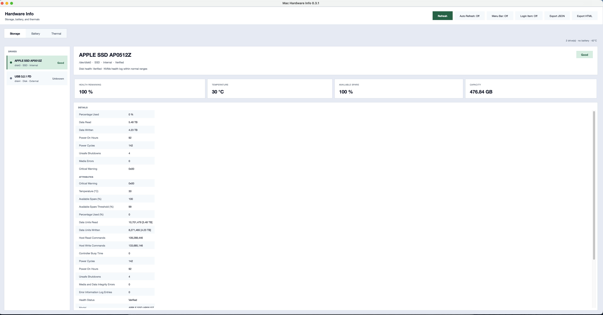
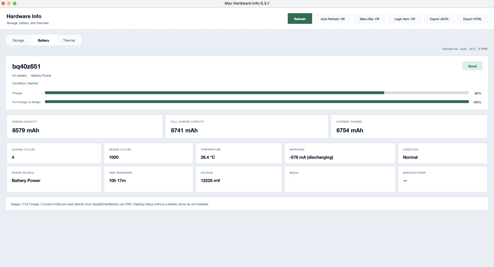
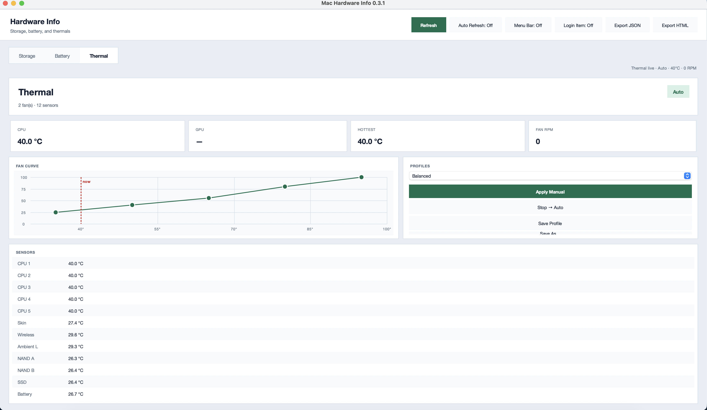

# Mac Hardware Info

Native macOS app for **SSD / NVMe health**, **battery capacity** , and **Apple Silicon thermal / fan curves**. No Homebrew. Export JSON or HTML locally.


**Version:** 0.3.1

## Screenshots

**Storage**



**Battery**



**Thermal**



## Features

### Storage
- Full **NVMe health log** via our own IOKit helper (`native/nvme_health.c`):
  - Temperature, available spare (+ threshold), percentage used
  - Data units read / written (TB), host read/write commands
  - Power-on hours, power cycles, unsafe shutdowns
  - Media errors, critical warning, error log entries
- Disk identity: model, serial, firmware, vendor, NAND type, NVMe version
- Health verdict: **Good / Caution / Bad**
- Detail attribute list in the UI

### Battery (MacBook)
- **Design Capacity (mAh)** — original rated capacity (`DesignCapacity`)
- **Full Charge Capacity (mAh)** — what 100% holds now (`AppleRawMaxCapacity`)
- **Current Charge (mAh)** — charge in the pack now (`AppleRawCurrentCapacity`)
- Charge %, max capacity % vs design, charge cycles, design cycles
- Condition, temperature (°C), voltage, amperage (charging / discharging)
- Time remaining when available
- Desktop Macs without a battery show as not installed

### Thermal (Apple Silicon)
- Live CPU / GPU / SSD (and related) sensors + fan RPM / target / min–max
- ASUS-style **curve editor** (temp °C → fan %) with drag points
- Built-in profiles: Silent, Balanced, Performance, Full — plus Save / Save As / Delete for customs
- **Apply Manual** — admin password once to start a privileged `smc_thermal` daemon; curve follows hottest tracked sensor
- **Stop** — returns fans to macOS Auto **without** another password (daemon stays resident)
- Quit restores Auto and exits the daemon
- Safety: clamp to SMC min/max RPM, slew limit, emergency full speed near critical °C
- Fanless Macs (e.g. some Airs): monitor only; Intel: Thermal unsupported for control
- Thermal tab live-refreshes ~1.5s while open (and while Manual is active)

### App UX
- Daylight Tkinter UI with **Storage** / **Battery** / **Thermal** segments
- Primary metrics up front; secondary storage stats + SMART attrs under **Details**
- Battery: animated charge bars + design / full / current **mAh** row, then secondary tiles
- Hover / press feedback, Tab focus rings, system cursor
- Manual **Refresh** + **Auto Refresh** (live updates every 3s; selection preserved)
- Non-blocking scans (background thread) with skeleton loading + “Updated just now”
- Export **JSON** and **HTML** reports
- **Menu bar app** (built `.app`): status icon in the top bar; **Open** / **Hide Window** / **Refresh** / **Quit** menu
- **Menu Bar mode**: hides Dock icon; red close button hides the window (app keeps running)
- **Open at Login**: optional startup via macOS Login Items
- Dock icon when not in Menu Bar mode: Settings Tool (`assets/AppIcon.icns`)

## Requirements

- macOS 14+ (Apple Silicon or Intel; **fan control = Apple Silicon only**)
- Python 3.10+ (stdlib / Tkinter; **PyObjC** for menu bar mode — included in build deps)
- Xcode Command Line Tools (to build the native helpers once)
- Admin password when first enabling Manual fan control

```bash
xcode-select --install   # if needed
```

## Quick start

```bash
make helper          # builds ssdinfo/bin/nvme_health + smc_thermal
python3 main.py
python3 main.py --menu-bar   # dev: menu bar accessory (needs PyObjC)
```

### CLI

```bash
python3 main.py --cli
python3 main.py --cli --ssd-only
python3 main.py --json ~/Desktop/hardware-info.json
python3 main.py --html ~/Desktop/hardware-info.html
```

### Menu bar & startup (built `.app`)

The distributed `.app` shows a **status icon** in the menu bar (near battery/Wi‑Fi). Use the menu to **Open**, **Hide Window**, **Refresh**, or **Quit**.

| Control | What it does |
|---|---|
| **Menu Bar: On** (in app) | Hides Dock icon; close button hides window instead of quitting |
| **Login Item: On** | Adds the app to **System Settings → Login Items** |
| Red close button (Menu Bar on) | Hides window — app keeps running in menu bar |
| Menu bar → **Quit** | Fully exits; restores fan Auto if Manual was active |

Manual launch opens the main window. With **Login Item** and **Menu Bar** both on, startup can stay in the background (menu bar only).

Preferences: `~/Library/Application Support/Mac Hardware Info/preferences.json`

## Build a Mac `.app` + zip (distribute)

Uses system `python3` (no venv required):

```bash
pip3 install -r requirements-build.txt   # once (py2app)
make release
```

That runs: `make helper` → `python3 setup.py py2app` → zip.

Outputs:
- `dist/Mac Hardware Info.app` — run locally
- `dist/MacHardwareInfo-0.3.1-macos.zip` — share / upload

Manual steps:

```bash
make helper
python3 setup.py py2app
make zip
```

Builds are **ad-hoc signed** (no Apple Developer ID on the build machine yet). Downloaded zips may still need **System Settings → Privacy & Security → Open Anyway**.  
Developer ID codesign + notarization: see [CONTEXT.md](CONTEXT.md).

## Project layout

```
main.py                 # GUI + CLI entry
native/
  nvme_health.c         # NVMe SMART reader (IOKit)
  smc_thermal.c         # AppleSMC sensors + fan control helper
ssdinfo/
  gui.py                # Tkinter UI (threaded scan, auto-refresh, exports)
  macos_services.py     # menu bar status item, login item, activation policy
  app_prefs.py          # user preferences (Application Support)
  resources.py          # bundle asset paths
  thermal_panel.py      # Thermal segment + fan curve editor
  thermal.py            # smc_thermal status wrapper
  fan_control.py        # privileged curve daemon Apply/Stop
  profiles.py           # fan curve profiles (Application Support)
  scanner.py            # diskutil + ioreg + NVMe health merge
  nvme_health.py        # launches native NVMe helper
  battery.py            # AppleSmartBattery mAh / cycles
  export.py             # JSON / HTML
  models.py
  bin/nvme_health       # built by: make helper
  bin/smc_thermal       # built by: make helper
Makefile                # helper | app | zip | release
setup.py                # py2app + AppIcon.icns
assets/
  AppIcon.icns          # Dock icon (option C — Settings Tool)
  icons/                # A–D icon options
LICENSE                 # MIT
CONTEXT.md              # architecture & publish notes
```

## How data is read (no third-party tools)

| Area | Source |
|---|---|
| NVMe health | Our C helper → Apple `IONVMeSMARTInterface` (`SMARTReadData`) |
| Disk list / identity | `diskutil`, `ioreg` |
| Battery mAh / cycles | `AppleSmartBattery` via `ioreg`, plus `pmset` / `system_profiler` |
| Temps / fans | Our `smc_thermal` helper → `AppleSMC` (`status` is unprivileged; control needs admin once) |

No smartctl, no Homebrew. Fan curve source is original (`native/smc_thermal.c`); public SMC key names only — no third-party fan-tool source copied.

## Privacy

Runs entirely on-device. No telemetry. Exports only where you choose.

Fan profiles, control state, and app preferences:

- `~/Library/Application Support/Mac Hardware Info/fan_profiles.json`
- `~/Library/Application Support/Mac Hardware Info/fan_control_state.json`
- `~/Library/Application Support/Mac Hardware Info/preferences.json`

Daemon diagnostics (when Manual is used): `/tmp/smc_thermal_daemon.log`, `/tmp/smc_thermal_daemon.pid`

## Disclaimer

Health figures are indicators, not failure predictions. Keep backups.  
Manual fan curves can change noise and thermals — **Stop** (or quitting the app) returns control to macOS. Use at your own risk.

## License

MIT — see [LICENSE](LICENSE).
